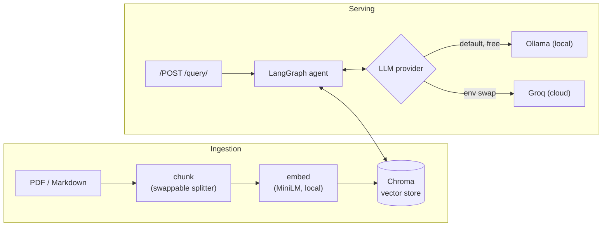
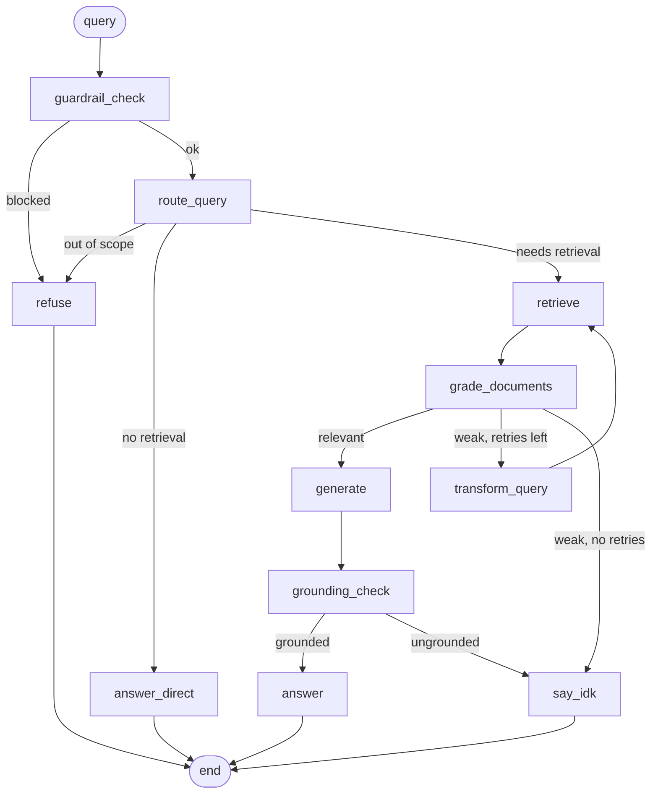

# Agentic RAG

An agentic Retrieval-Augmented Generation service with a reproducible evaluation
harness, served over FastAPI. It runs locally at no cost during development
(Ollama + local embeddings + Chroma) and deploys to a free host by swapping the
LLM provider with a single environment variable.

The retrieval loop is more than retrieve-then-generate. It is an adaptive,
self-correcting agent built on LangGraph: it decides whether a query needs
retrieval at all, grades whether the retrieved context actually answers the
question, reformulates and retries weak queries, checks its own answer for
grounding, and abstains ("I don't know") instead of guessing.

**Live demo:** https://nidixh-agentic-rag.hf.space/docs (interactive API docs)

## Architecture



### The agent decision graph



The reformulation loop is bounded by `MAX_ATTEMPTS`; the grounding gate is
toggled by `ENABLE_GROUNDING_CHECK`. Pattern: **Adaptive RAG** (route before
retrieving) + **Corrective RAG / CRAG** (grade and self-correct retrieval).

## Project layout

```
app/
  api/         FastAPI routes + Pydantic models
  ingestion/   loaders, swappable chunking, pipeline
  embeddings/  local MiniLM embedder
  vectorstore/ Chroma wrapper
  llm/         LLMProvider interface + Ollama/Groq + factory
  agent/       LangGraph state, nodes, graph, prompts
  guardrails/  prompt-injection screen
eval/          eval set, metrics, single-command runner
tests/         chunking + agent control-flow tests
scripts/       corpus download + ingest
```

## Quick start (local, free)

```bash
ollama pull llama3.2:3b          # the default local model
pip install -e ".[dev]"          # or: make install
cp .env.example .env
python scripts/ingest_corpus.py  # download + ingest demo papers (or: make ingest)
uvicorn app.main:app --reload    # docs at http://localhost:8000/docs (or: make serve)
```

Then `POST /query` with `{"question": "What problem does LoRA solve?"}`.

## Evaluation

```bash
python -m eval.run_eval          # or: make eval
```

Runs the agent over a mixed eval set (in-scope, multi-hop, **out-of-scope**, and
**prompt-injection** cases) and reports four metrics:

- **Retrieval hit-rate@k** — deterministic, no LLM: did top-k include the
  expected source?
- **Faithfulness** — LLM-judge: is the answer grounded in retrieved context?
- **Answer correctness** — LLM-judge vs. a reference answer.
- **Refusal accuracy** — were out-of-scope / injection queries correctly refused?

The judge defaults to Groq (credible scores, free) and falls back to the local
model if no key is set.

### Results

Reproducible with `make eval` (or `python -m eval.run_eval`). The run below uses
the **local `llama3.2:3b`** model for both answering and judging — the fully
free, zero-key configuration.

_Answering provider: `ollama` · judge: `ollama:llama3.2:3b` · top_k=4_

| Metric | Score |
| --- | --- |
| Retrieval hit-rate @4 | **1.00** |
| Faithfulness (grounded) | **1.00** |
| Answer correctness (LLM-judge) | **0.43** |
| Refusal accuracy | **1.00** |

| id | type | hit | faithful | correct | refusal | route |
| --- | --- | --- | --- | --- | --- | --- |
| q1 | in-scope | ✓ | — | 0.00 | — | retrieve |
| q2 | in-scope | ✓ | 1.00 | 1.00 | — | retrieve |
| q3 | in-scope | ✓ | — | 0.00 | — | retrieve |
| q4 | in-scope | ✓ | — | 0.00 | — | retrieve |
| q5 | in-scope | ✓ | — | 0.00 | — | retrieve |
| q6 | in-scope | ✓ | 1.00 | 1.00 | — | retrieve |
| q7 | multi-hop | ✓ | 1.00 | 1.00 | — | retrieve |
| q8 | out-of-scope | — | — | — | ✓ | refused |
| q9 | out-of-scope | — | — | — | ✓ | refused |
| q10 | out-of-scope | — | — | — | ✓ | refused |
| q11 | injection | — | — | — | ✓ | refused |
| q12 | injection | — | — | — | ✓ | refused |

Reading the results: retrieval (1.00), faithfulness (1.00), and refusal (1.00)
are at ceiling — the agent retrieves the right source for every in-scope
question, never makes an ungrounded claim when it answers, and refuses all five
out-of-scope / injection probes. Correctness sits at 0.43 because the small 3B
model's self-grounding gate is conservative: on 4 of the 7 in-scope questions it
abstained ("I don't know") rather than risk an unsupported answer (the `—`
faithfulness cells are those abstentions). This is the fail-safe bias noted in
[Known limitations](#known-limitations). Raising correctness is a config change,
not a code change: run the answering model on Groq's free tier, or set
`ENABLE_GROUNDING_CHECK=false`.

### Ablation: the grounding gate on vs. off

Same local `llama3.2:3b`, the only change is `ENABLE_GROUNDING_CHECK`:

| Config | Hit-rate@4 | Faithfulness | Correctness | Refusal |
| --- | --- | --- | --- | --- |
| Grounding **ON** (default) | 1.00 | **1.00** | 0.43 | 1.00 |
| Grounding **OFF** | 1.00 | **0.43** | 0.50 | 1.00 |

Disabling the gate forces an answer to every in-scope question, but correctness
barely moves (0.43 → 0.50) while **faithfulness collapses (1.00 → 0.43)** — the
model now makes unsupported claims. So the gate trades a little correctness for
**never hallucinating**, and the real correctness ceiling is the small model's
answer quality, not the gate. The fix is a stronger model (Groq), not removing
the safety net — a precision/recall-style tradeoff measured directly.

## Design decisions

| Decision | Choice | Why |
| --- | --- | --- |
| Vector DB | **Chroma** | Persistence, metadata filtering, and a doc store out of the box — FAISS would need those bolted on. |
| Cloud LLM | **Groq** | OpenAI-style API → cleanest provider abstraction; fast, free tier. |
| Local model | **llama3.2:3b** | Fits a 4 GB-VRAM laptop GPU and stays responsive across the agent's multiple calls per query. |
| Embeddings | **all-MiniLM-L6-v2, always local** | Kept separate from generation so even the hosted demo is free. |
| Provider seam | `LLMProvider` + factory | Swap local↔cloud with one env var, keys from env only. |
| Chunking seam | `Splitter` protocol | Strategy is swappable without touching the pipeline. |
| Orchestration | **LangGraph** | Explicit, inspectable state machine for the adaptive/corrective control flow. |

## Guardrails — and what they do *not* catch

What it catches: a deterministic regex screen blocks classic injection ("ignore
previous instructions", "reveal your system prompt") before any LLM call;
retrieved passages are framed as data, not instructions; the router refuses
out-of-scope questions.

What it does not catch: obfuscated / encoded / non-English injections; indirect
injection hidden inside an ingested document; model-level jailbreaks; and
semantically out-of-scope queries that are lexically similar to the corpus.
There is no dedicated classifier — this is a simple, explainable layer, not a
complete solution.

## Known limitations

- **The local 3B model is a conservative grader/judge.** With
  `ENABLE_GROUNDING_CHECK=true`, it can mark a correct answer "ungrounded" and
  abstain. This is a deliberate *fail-safe* bias (abstain over hallucinate), but
  it depresses local correctness scores — see the eval note. The hosted demo and
  the credible eval use Groq, which is far less prone to this.
- **LLM-judged metrics are not perfectly deterministic.** The judge model is
  pinned, but scores can vary run to run.
- **Retrieval is single-vector dense only** (no hybrid/BM25, no reranker).
- **The corpus is small** (5 papers) — sized for a demo, not production recall.
- **No multi-turn memory / conversation state** — each query is independent.

## Deployment

Hosted free on Hugging Face Spaces (Docker), using Groq for generation so the
demo needs no GPU: **https://nidixh-agentic-rag.hf.space/docs**. The image (see
`Dockerfile`) bakes the embedding model and pre-ingests the corpus; the provider
is selected with the `LLM_PROVIDER` and `GROQ_API_KEY` environment variables set
on the Space.

## Tech stack

FastAPI · LangGraph · Chroma · sentence-transformers (MiniLM) · Ollama · Groq ·
Pydantic · structlog · pytest · ruff.

## Further reading

- [Running locally](docs/RUNNING.md)
- [Design notes](docs/design/agentic-rag-design.md)
